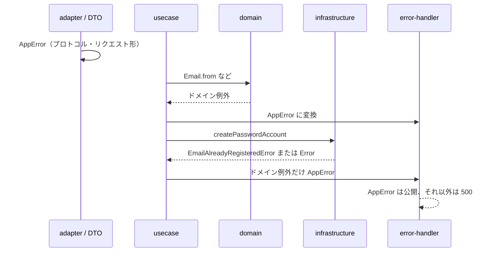

# 例外の層分け（ドメイン / 検証 / HTTP）

## 目的

例外の種類を「どの境界で失敗したか」で揃え、`src/domain` から HTTP（`AppError`）への依存をなくす。

クライアントへ返す公開エラーはこれまでどおり `AppError` のみ。変えるのは **誰が HTTP のステータスと code を決めてよいか** である。

## 方針

```
HTTP / プロトコル     adapter          → 最初から AppError
リクエストの形        application/dto  → 最初から AppError
ユースケースの前提    application      → 最初から AppError
業務ルール・値の意味  domain           → ドメイン例外 → usecase が AppError に変換
想定外・インフラ障害  infra / 契約破り → 素の Error または SDK 例外 → 500
```

| 層 | 投げてよいもの | 例 |
|---|---|---|
| adapter | `AppError` | Origin、JSON、uid 不一致、未対応 prompt |
| application/dto | `AppError` | 必須キー欠落、文字列長、オブジェクトでない |
| application/usecase | `AppError`（前提・結果）、ドメイン例外の変換 | prompt 不一致、認証失敗、重複メール → 409 |
| domain | HTTP 非依存の Error サブクラス | 不正な email、重複メール |
| infrastructure | ドメイン例外への翻訳、または素の Error | Dynamo の条件失敗 → `EmailAlreadyRegisteredError`、欠落 email は契約破りなら `Error` |

DynamoDB に保存済みの壊れデータ（`User.parse` 失敗）はクライアントの 400 ではない。インフラの想定外として 500 にする。

## 対象フロー



## 実装タスク

### 1. ドメイン例外を HTTP 非依存にする

- [ ] `src/domain` から `@/http/app-error` の import をなくす。
  - 現状: `src/domain/user/email.ts`、`user.ts`、`user-id.ts`
- [ ] `src/domain/user/error.ts` に値オブジェクト用の例外を足す（既存の `EmailAlreadyRegisteredError` と同じファイルでよい）。
  - `InvalidEmailError`
  - `InvalidUserIdError`
  - `InvalidUserError`（永続化データの形が壊れているとき。HTTP 400 用ではない）
- [ ] `Email.parse` / `UserId.parse` / `User.parse` は上記を throw する。メッセージは業務の説明のみ。status / `ErrorCodes` は持たない。

完了条件:

- `src/domain/**` を grep して `app-error` が出ない。
- `Email.from("not-an-email")` が `InvalidEmailError` になる。

### 2. usecase でドメイン例外を `AppError` に変換する

- [ ] 登録: `Email.from` など値オブジェクト構築を try/catch し、`InvalidEmailError` → `AppError(400, invalidEmail)`。
- [ ] ログイン: 同様に `Email.from` を変換する。形式不正は 401 にせず 400 のまま（認証失敗 `invalidCredentials` と混ぜない）。
- [ ] 登録の `EmailAlreadyRegisteredError` → `AppError(409)` は現状維持。
- [ ] 変換用の小さな mapper を usecase 直下または `src/application` に置いてもよい。adapter / domain には置かない。

完了条件:

- 不正 email の登録・ログインは 400 `invalid_email`。
- 重複メールは 409 `email_already_registered`。
- ドメイン例外が usecase をすり抜けて error-handler に届き 500 にならない。

### 3. adapter と DTO の `AppError` はそのままにする

変更しない（方針どおり HTTP 境界の検証だから）。

- [ ] 確認のみ: `src/adapter/validation/*`（same-origin、json-body、uid、prompt、client）
- [ ] 確認のみ: `src/application/dto/interaction/*`（registration、password-verify、interaction）
- [ ] 確認のみ: usecase の前提ガード（`loginNotRequired`、`registrationNotAllowed`、`consentNotRequired`、`invalidCredentials`）

完了条件:

- 上記が引き続き `AppError` を直接 throw する。
- これらをドメイン例外に置き換えない。

### 4. インフラの例外翻訳を方針どおり残す / 補う

- [ ] `DynamoRegistrationRepository` の重複メール → `EmailAlreadyRegisteredError` は維持。
- [ ] `user.email` 欠落は契約破りとして素の `Error` のまま（500）。password 登録の usecase が常に email 付き `User` を渡す前提をコメントで残す。
- [ ] PROFILE / PASSWORD の `ConditionalCheckFailed` はドメイン例外にしない（現状どおり SDK 例外 → 500）。
- [ ] `UserRepository` が `User.parse` に失敗したときは `InvalidUserError` を 400 に変換せず、インフラの想定外として再 throw するか、永続化破損用の別例外にする。error-handler では 500。

完了条件:

- 壊れた User レコードを読んでもクライアントに `invalid_user` の 400 を返さない。
- 重複メールだけが 409。

### 5. 呼び出し漏れの棚卸し

- [ ] `Email.from` / `UserId.from` / `User.parse` の全呼び出しを洗い、HTTP usecase 以外（seed、oidc `findAccount`、Dynamo 読み出し）でもドメイン例外が 500 になることを確認する。
  - seed スクリプトはプロセス終了でよい。
  - oidc `findAccount` に壊れた id が来た場合は 400 ではなく認可エラー / 500 のどちらにするか、実装時に既存の oidc-provider エラー処理と揃える。

完了条件:

- `pnpm ts:check` と `pnpm lint` が通る。
- 登録（不正 email / 重複 / 正常系）とログイン（不正 email / 認証失敗）を手動または既存手順で確認できる。

## やらないこと

- error-handler の公開 JSON 形（`error` / `code` / `message`）の変更
- OIDC の `InvalidRequest` など oidc-provider 例外の層分け（別経路のまま）
- ドメインを Result 型に置き換える大規模リファクタ
- password 強度など、DTO に既にある形の検証をドメインへ移すこと（形は DTO、意味はドメイン、の分担を維持）

## 受け入れ

- [ ] `src/domain` が `@/http` に依存しない。
- [ ] adapter / DTO / usecase ガードは `AppError` のまま。
- [ ] 業務として起こり得る失敗（不正 email、重複メール）は usecase 経由で 4xx。
- [ ] 契約破りと Dynamo 障害は 500。
