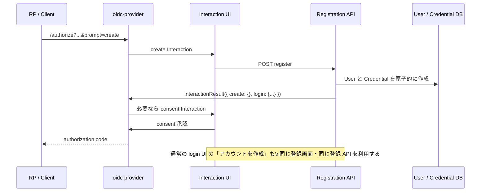

# `prompt=create` とログイン画面からのアカウント作成

## 目的

OIDC RP が `prompt=create` を指定した認可リクエストで、サインインではなくアカウント作成 UI を直接表示できるようにする。
また、通常のログイン Interaction でも、未登録の利用者が明示的にアカウント作成へ進めるようにする。

`prompt=create` はアカウント作成 UI を希望することを OP に伝える OIDC 拡張である。作成成功は登録 API の成功時点ではなく、後続の認可レスポンスとトークン取得まで完走して初めて RP が判断する。

## 対象フロー



## 実装タスク

### 1. OIDC の `create` prompt を受理する

- [ ] `src/oidc/config.ts` で `interactionPolicy.base()` を取得する。
- [ ] `new interactionPolicy.Prompt({ name: "create", requestable: true })` を policy の先頭に追加する。
  - `login` より後に置くと、未ログイン利用者には `login` が先に要求され、登録 UI が開かない。
- [ ] Discovery metadata に `prompt_values_supported: ["none", "login", "consent", "create"]` を設定する。
- [ ] `prompt=create` と他の prompt 値の併用は初期リリースではサポート対象外として、クライアント向けに単独指定を案内する。

完了条件:

- `GET /authorize?...&prompt=create` が `invalid_request` にならず、最初に create Interaction へ 303 redirect される。
- `/.well-known/openid-configuration` の `prompt_values_supported` に `create` が含まれる。

### 2. Interaction context と UI に create 画面を追加する

- [ ] `src/adapter/validation/prompt.ts` が `"create"` を許可するようにする。
- [ ] `apps/interaction-ui/src/types/interaction.ts` の `InteractionPrompt` に `"create"` を追加する。
- [ ] `apps/interaction-ui/src/App.tsx` で `interaction.prompt === "create"` のとき `Registration` コンポーネントを表示する。
- [ ] 登録画面にメールアドレス、表示名（任意）、パスワードまたは Passkey 登録の UI を実装する。
- [ ] 登録のキャンセル時は `interactionResult({ error: "access_denied" })` で認可リクエストを終了する。

完了条件:

- create Interaction の context API が `prompt: "create"` を返し、登録 UI に切り替わる。
- Interaction の UID が URL と cookie で一致しない場合は既存どおり拒否される。

### 3. 通常の login UI から登録へ進めるようにする

- [ ] `Login` / `PasswordLogin` に「アカウントを作成」リンクまたはボタンを追加する。
- [ ] クリック後は同じ Interaction の中で登録 UI に表示を切り替えるか、登録専用画面へ遷移する。
  - この場合の Interaction 自体の prompt は `login` のままでよい。UI 上のモードとして `signIn` / `signUp` を持つ。
  - `prompt=create` の場合だけは最初から `signUp` モードにする。
- [ ] ログイン失敗時に「未登録です」と断定して自動遷移しない。
  - アカウント列挙を避けるため、認証失敗は従来どおり汎用エラーにし、利用者が明示的に登録リンクを選ぶ形にする。
- [ ] 登録完了後は、元の Interaction が `login` でも `create` でも `login` result を返し、同一の認可リクエストを再開する。

完了条件:

- 通常の `/authorize` → login UI から、利用者の操作で登録画面へ到達できる。
- 登録完了後、改めて `/authorize` を開始せず元の `state`、PKCE、`nonce` を保ったまま認可処理が続く。

### 4. 登録 use case と API を実装する

- [ ] `src/application/dto/interaction/registration.ts` を追加し、入力（email、displayName、password など）を検証する。
- [ ] `src/application/usecase/interaction/registration.ts` を追加する。
  - Same Origin を確認する。
  - `provider.interactionDetails()` で UID を確認する。
  - prompt が `create` または `login` であることを検証する。
  - user と credential を作成する。
  - `provider.interactionResult()` で `redirectTo` を返す。
- [ ] `src/adapter/routes.ts` に `POST /api/interactions/:uid/register` を追加する。
- [ ] UI API client と `Registration` コンポーネントからこの endpoint を呼ぶ。

create Interaction を解決する結果:

```ts
{
  create: {},
  login: {
    accountId: user.id.value,
    ts: Math.floor(Date.now() / 1000),
    amr: ["pwd"], // Passkey 登録時は ["webauthn"]
  },
}
```

`create: {}` がないと custom prompt が未解決になり、登録 UI へ戻り続ける。login Interaction から始めた登録では `login` result だけでよい。

完了条件:

- 登録に成功すると `redirectTo` を受け取って authorization resume URL へ遷移する。
- 必要な consent の後、RP は authorization code を受け取り、PKCE で token exchange できる。
- 二重送信・期限切れ Interaction・UID 不一致は安全に失敗する。

### 5. 永続化を登録単位で原子的にする

- [ ] `UserRepository.save()` と `PasswordCredentialRepository.save()` を順番に呼ぶだけの登録処理にしない。
- [ ] `RegistrationRepository` などの登録専用 port を追加する。
- [ ] DynamoDB `TransactWriteItems` で、次の書き込みを一括実行する。
  - User profile (`USER#{id}` / `PROFILE`)
  - Email の一意インデックス (`EMAIL#{normalizedEmail}` / `UNIQUE`、新規作成条件付き)
  - Password credential (`USER#{id}` / `PASSWORD`、新規作成条件付き)
- [ ] 重複メールの場合は partial user / credential を残さず、登録済み用の安全なエラーを返す。
- [ ] email は保存・検索とも同じ規則で正規化する（少なくとも trim と小文字化の方針を固定する）。

完了条件:

- 同じ email の同時登録でアカウントは最大 1 件だけ作られる。
- 途中失敗で孤立した profile や credential が残らない。

### 6. 配備基盤を補完する

- [ ] `infra/cdk/lib/idp.ts` に User table と Credential table を追加する。
- [ ] Lambda に `USER_TABLE_NAME` と `CREDENTIAL_TABLE_NAME` を渡す。
- [ ] 両テーブルへの read/write IAM 権限を Lambda に付与する。
- [ ] ローカル用の `.env.sample` と table 作成手順を、User/Credential table を含む実際の環境変数に揃える。

完了条件:

- CDK deploy 後の Lambda が必須環境変数不足で起動失敗しない。
- ローカルと AWS の双方で登録・ログイン・認可コード発行まで実行できる。

### 7. Passkey を登録手段にする場合の追加タスク

現状の Passkey UI は `/api/interactions/:uid/login` を呼ぶが、対応する API、WebAuthn 検証、Passkey credential 永続化は未実装である。password 登録を最小リリースとし、Passkey は別途以下を実装する。

- [ ] registration options endpoint: challenge、RP ID、user handle を生成して短命に保存する。
- [ ] `navigator.credentials.create()` を実行する UI を作る。
- [ ] registration verify endpoint: challenge、origin、RP ID、attestation、public key、sign count を検証する。
- [ ] Passkey credential の domain model、port、DynamoDB 実装を追加する。
- [ ] 検証成功と user 作成を同じ登録トランザクションとして扱う。

## 受け入れテスト

- [ ] `prompt=create` で create UI が login UI より先に表示される。
- [ ] Discovery から `create` 対応を検出できる。
- [ ] login UI の登録リンクから同じ registration UI に進める。
- [ ] password 登録後、consent を経て authorization code と token を取得できる。
- [ ] email 重複、二重送信、Interaction 期限切れ、UID 不一致、CSRF を拒否する。
- [ ] 既存セッション中に別アカウントを登録するケースを確認する。
  - oidc-provider のセッション切替・ログアウトを挟んでも authorization resume が完走すること。
